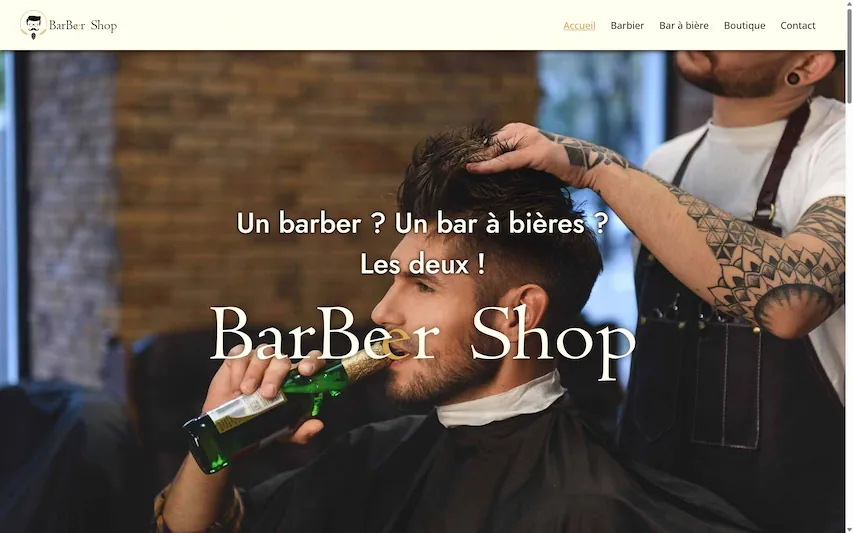

# 💈 BarbeerShop

Site vitrine fictif développé dans le cadre d’un projet de webdesign, puis repris en React afin d’explorer le développement front-end moderne.

## 🚀 Aperçu

## 📌 Fonctionnalités

- 🖥️ page d’accueil immersive avec hero section
- 🎨 identité visuelle moderne et cohérente
- 📱 design responsive
- ⚛️ version développée avec React
- 🧱 structuration en composants réutilisables
- 🌐 présentation des services du barber shop

## 🛠️ Technologies utilisées

- HTML5
- CSS3
- JavaScript
- React
- outils de design (suite Adobe)

## 🎯 Objectifs du projet

Ce projet m’a permis de :

- concevoir une identité visuelle complète
- créer une maquette web professionnelle
- développer une interface responsive
- découvrir la logique des composants React
- structurer un projet front-end moderne

## 🎯 Ce que j’ai appris

- organisation d’un projet React
- découpage en composants
- gestion du style et de la mise en page
- adaptation d’un concept design vers du code

## 👨‍💻 Auteur

CHARVOT Marc
GitHub : https://github.com/PYXHD
